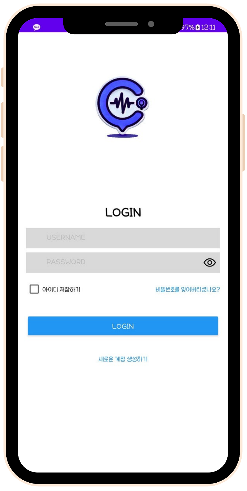
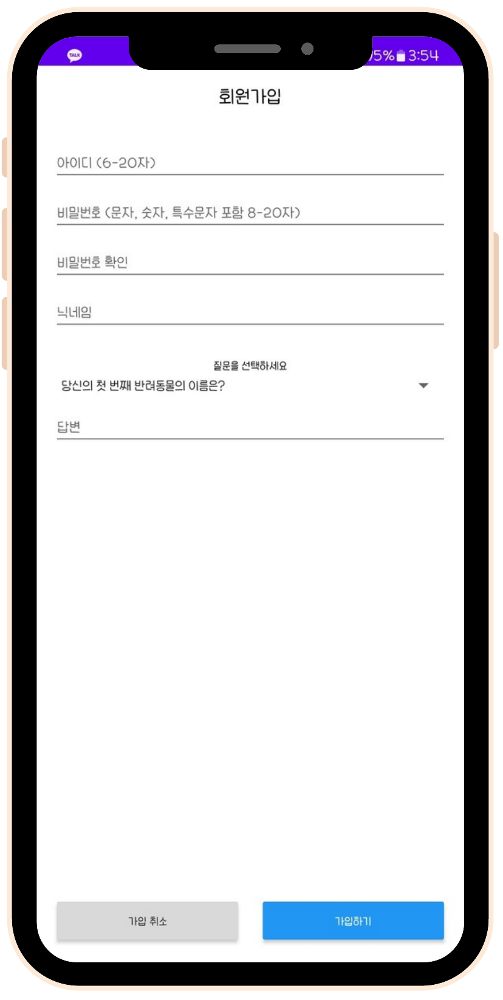
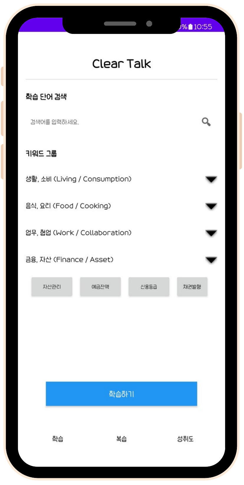
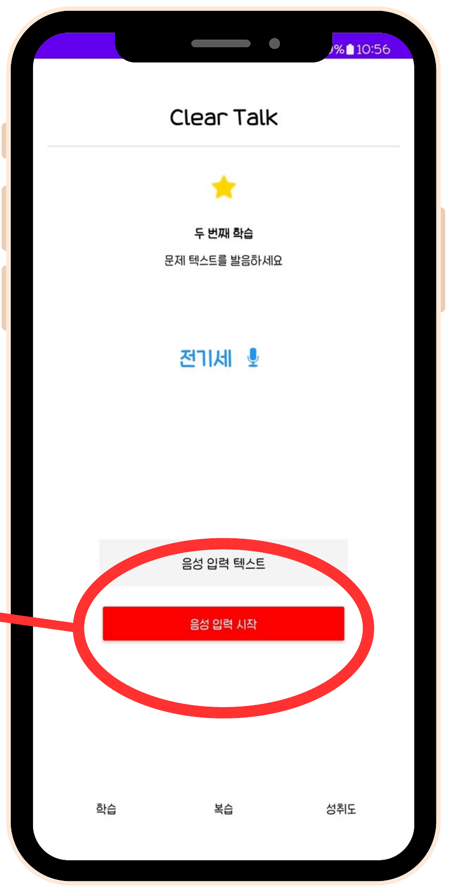
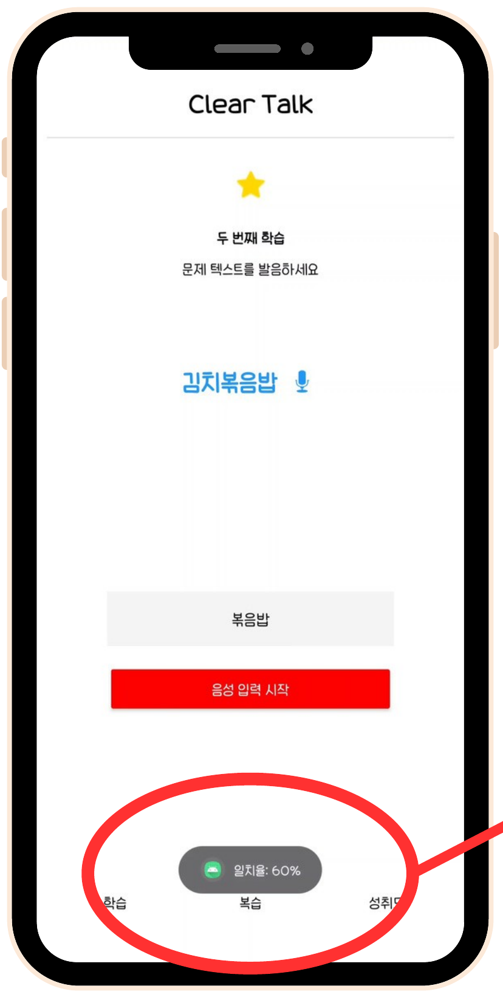
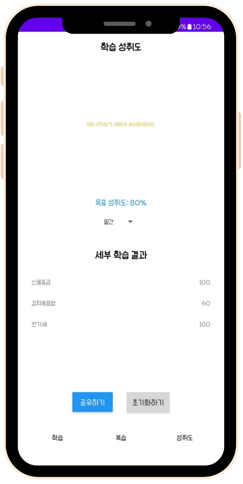

# 클리어톡 (ClearTalk)

조음장애 발음 교정 안드로이드 애플리케이션

본 프로젝트는 조음장애를 겪는 사용자를 대상으로, 사용자의 발음을 텍스트화하여 분석하고 실시간 피드백으로 교정을 돕는 비대면 발음 교정 애플리케이션이다.

## Background

조음장애는 말을 하기 위한 올바른 조음 움직임을 만드는 데 어려움을 겪는 장애로, 한국어 기준 특정 자음(예: /ㅅ/)을 정확히 발음하지 못하는 경우가 대표적이다. 2022년 WHO 보고에 따르면 전 세계 약 5~7%의 인구가 조음장애 또는 말소리 장애를 겪고 있으며, 국내에서는 연간 약 30만 명이 언어치료를 받고 있으나 의료 접근성과 시간 제약으로 치료를 포기하는 경우가 많다.

기존 대면 치료는 평균 월 50만 a원의 비용과 주 1~2회 방문의 시간 부담이 있어, 특히 지방 거주자는 적절한 서비스를 받기 어렵다. 2021년 Speech Therapy & Technology Journal 연구에 따르면 디지털 언어치료 프로그램은 전통적 치료법과 유사한 효과를 보이며 치료 지속성을 30% 이상 높이는 것으로 나타났다. 클리어톡은 이러한 배경에서, 시간과 장소의 제약 없이 스스로 훈련할 수 있는 디지털 발음 교정 도구로 기획되었다.

## App Screenshots

| 로그인 | 회원가입 | 메인 (단어 검색) |
|---|---|---|
|  |  |  |

| 발음 학습 (음성 입력) | 학습 결과 (일치율) | 학습 성취도 |
|---|---|---|
|  |  |  |

## System Architecture

```text
Service Layer
├── 로그인 서비스
├── 회원 정보 서비스
├── 음성 전송 서비스
├── 음성 일치도 서비스
└── 음성 분석 및 시각화

Middleware Layer
├── 회원 정보 관리/생성 모듈
├── 사용자 정보 관리/확인 모듈
├── 음성 제어/인식/분석 모듈
├── 음성 일치도 모듈
├── 학습 데이터 저장 모듈
├── DB 관리 모듈
└── Text 모듈

Library Layer  : CNN
DB Layer       : MySQL, Firebase
IDE            : Android Studio
```

## Main Features

- 사용자 로그인 및 회원가입
- 학습할 단어 검색
- 녹음 기반 발음 인식 및 표준 발음과의 일치율(정확도) 피드백
- 학습한 단어 복습 및 즐겨찾기
- 학습 성취도 시각화를 통한 동기부여

## Project Structure

```
24-2_ClearTalk/
├── android/                  # 안드로이드 앱 (Android Studio 프로젝트)
│   └── app/
│       └── src/main/java/com/example/ct_001/
│           ├── MainActivity.java
│           ├── LoginActivity.java
│           ├── SignupActivity.java
│           ├── LearningActivity_1.java     # 발음 학습 화면
│           ├── LearningActivity_2.java
│           ├── LearningDataActivity.java   # 학습 데이터/단어 목록
│           ├── LearningNextPage.java
│           ├── ReviewActivity.java         # 복습 기능
│           ├── ProgressActivity.java       # 성취도 시각화
│           └── GameActivity.java           # 게임 요소
│
└── prototype/
    └── speech_recognition_prototype.ipynb  # 음성 인식·발음 비교 초기 프로토타입
```

## Source Code Description

| Path | Description |
|---|---|
| `android/app/src/main/java/.../MainActivity.java` | 앱 메인 화면 및 네비게이션 |
| `android/app/src/main/java/.../LoginActivity.java` | 로그인 처리 |
| `android/app/src/main/java/.../SignupActivity.java` | 회원가입 처리 |
| `android/app/src/main/java/.../LearningActivity_1.java`, `LearningActivity_2.java` | 발음 학습 단계별 화면 |
| `android/app/src/main/java/.../LearningDataActivity.java` | 학습 단어 데이터 목록 |
| `android/app/src/main/java/.../ReviewActivity.java` | 학습한 단어 복습 화면 |
| `android/app/src/main/java/.../ProgressActivity.java` | 사용자 성취도 시각화 |
| `android/app/src/main/java/.../GameActivity.java` | 학습 동기부여를 위한 게임 요소 |
| `prototype/speech_recognition_prototype.ipynb` | SpeechRecognition, TF-IDF 기반 cosine similarity를 활용한 발음-표준발음 비교 초기 프로토타입 |

## Tech Stack

- **Android**: Java, Android Studio
- **Backend/DB**: Firebase (Realtime Database, Authentication)
- **음성 분석 프로토타입**: Python (SpeechRecognition, scikit-learn TF-IDF, cosine similarity)
- **개발 방법론**: 폭포수(Waterfall) 모델 — 분석-설계-개발-테스트 전 과정을 순차 진행

## Requirements

Android 앱 실행을 위해서는 아래가 필요하다.

- Android Studio
- 본인의 Firebase 프로젝트에서 발급받은 `google-services.json`

프로토타입 노트북 실행을 위한 Python 패키지:

```bash
pip install SpeechRecognition sounddevice numpy scikit-learn pyaudio
```

## How to Run

### Android 앱

1. `android/` 폴더를 Android Studio로 연다.
2. Firebase 콘솔에서 프로젝트를 생성하고, 발급받은 `google-services.json`을 `android/app/` 경로에 추가한다.
3. Gradle Sync 후 빌드 및 실행한다.

### 프로토타입 노트북

```bash
cd prototype
jupyter notebook speech_recognition_prototype.ipynb
```

## Repository Policy

다음 파일은 GitHub 저장소에 포함하지 않는다.

- `google-services.json` (Firebase 프로젝트 설정 키 파일)
- `build/`, `.gradle/`, `.idea/`, `.kotlin/` (빌드 캐시 및 IDE 설정)
- `local.properties`

Firebase 연동을 위해서는 본인의 Firebase 프로젝트에서 `google-services.json`을 발급받아 `android/app/` 경로에 직접 추가해야 한다.

## Development Status

- 사용자 로그인/회원가입
- 발음 학습 화면 및 단어 데이터 연동
- 복습 및 즐겨찾기 기능
- 성취도 시각화
- 게임 요소를 통한 동기부여 기능
- 음성 인식 기반 발음-표준발음 비교 프로토타입 (TF-IDF, cosine similarity)

## Future Plans

- **AI 기술 적용**: 딥러닝 알고리즘을 활용해 사용자의 발음 패턴을 더욱 정확히 분석하고, 개인화된 교정 프로그램을 제공. 자연어 처리 기술을 통한 대화형 인터페이스 구현.
- **VR/AR 기술 통합**: VR을 통해 가상의 언어 치료 환경을 구현하고, AR을 활용해 실시간 발음 교정 가이드를 제공하여 학습 몰입도와 동기부여를 강화.

## Team

KYIT (설계 및 프로젝트 기본2, 2024-2학기)

| 역할 | 담당 | 내용 |
|---|---|---|
| PM | 이서경 | 프로젝트 총괄 |
| CM | 송성헌 | 문서 및 버전 관리 |
| QA | 임종서 | 품질 검증 |
| ENG | 금진호, 조은채 | 개발 |

## Notes

본 프로젝트는 설계 및 프로젝트 기본2 교과목의 팀 프로젝트 결과물이다. 실제 조음장애 진단이나 치료를 대체하지 않으며, 자가 발음 연습을 위한 보조 도구로 설계되었다.
